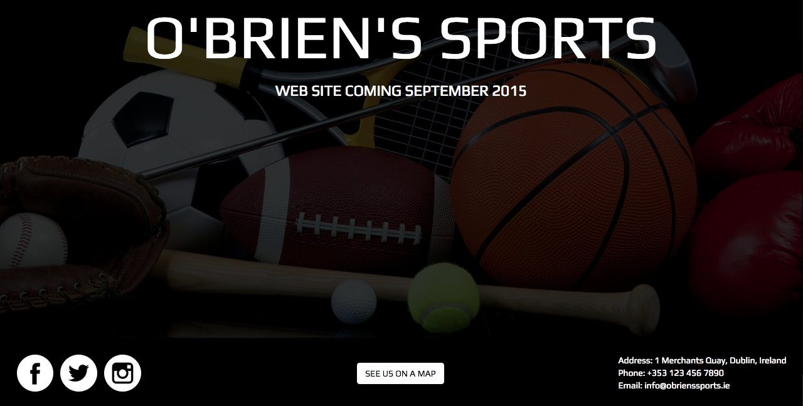

#Short Challenge
Issued by [Sanjay](http://github.com/sanjsanj)

###Task

Create a landing page for an independent high street sports store.

###Specs

Your finished prototype should:

- Inform visitors that the full website is launching soon.
- Show them how to find the bricks and mortar store.
- Be slimline, it's a very simple prototype, don't overdo it.
- Look good.

###Feast Your Eyes
